# CocoaPods 本地私有库
> 在iOS日常开发中,经常CocoaPods来管理一些常用的第三方库,那么如果我们要想要别人使用自己的库该怎么做呢?第一步,就是制作自己的本地库,再上传到CocoaPods上供别人使用.如果你制作的库只供自己内部的人员使用,该怎么做呢,就是使用私有库.再这里给大家讲一下本地私有库的制作.

### 本地私有库制作
- 下图就是准备的本地私有库文件
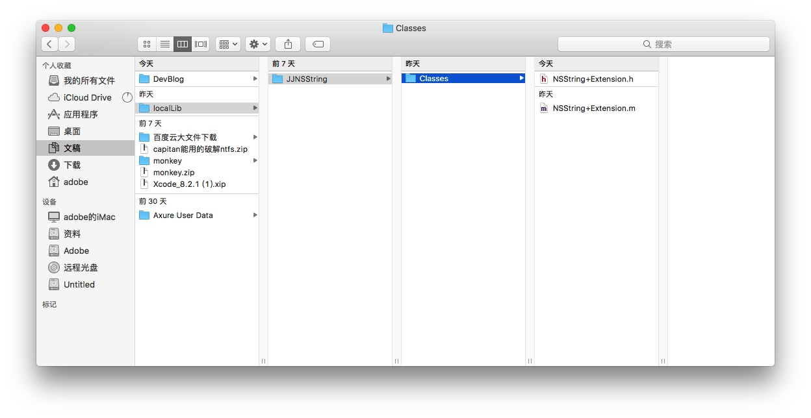
- 把本地私有库加入git管理
 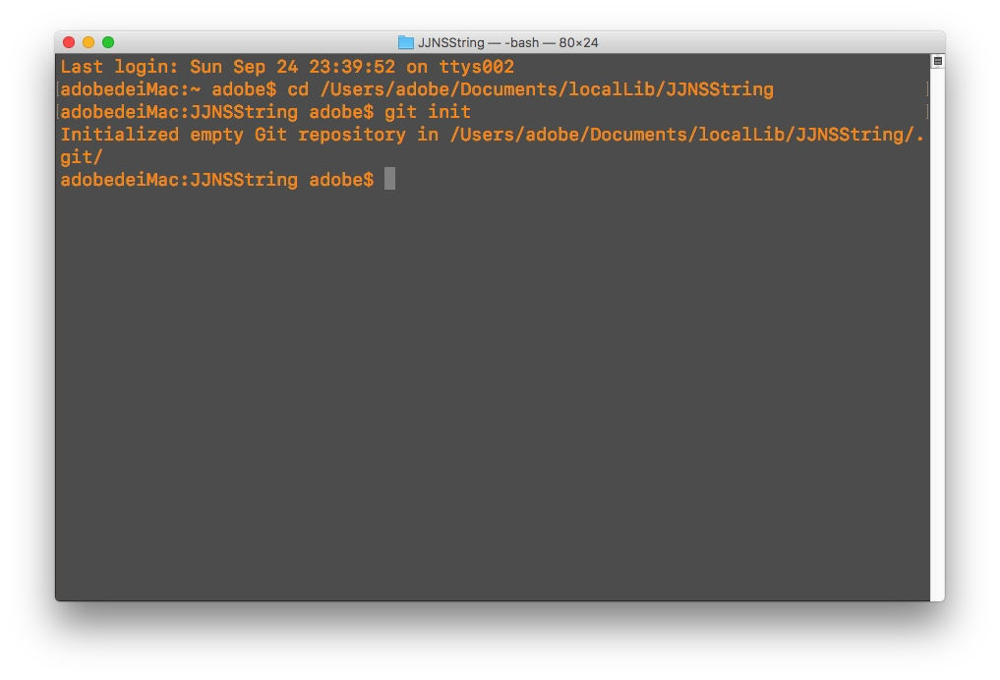
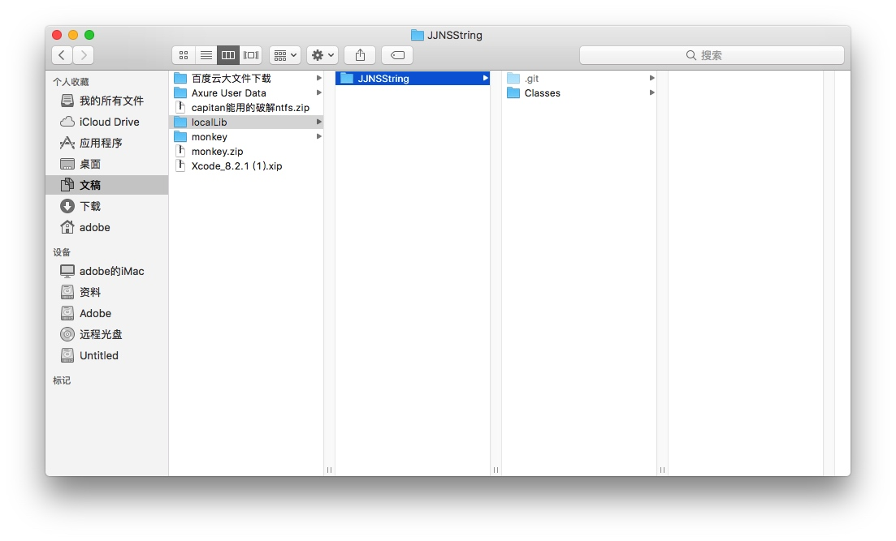
- 创建pod spec文件,尽量跟私有库的名字保持一致
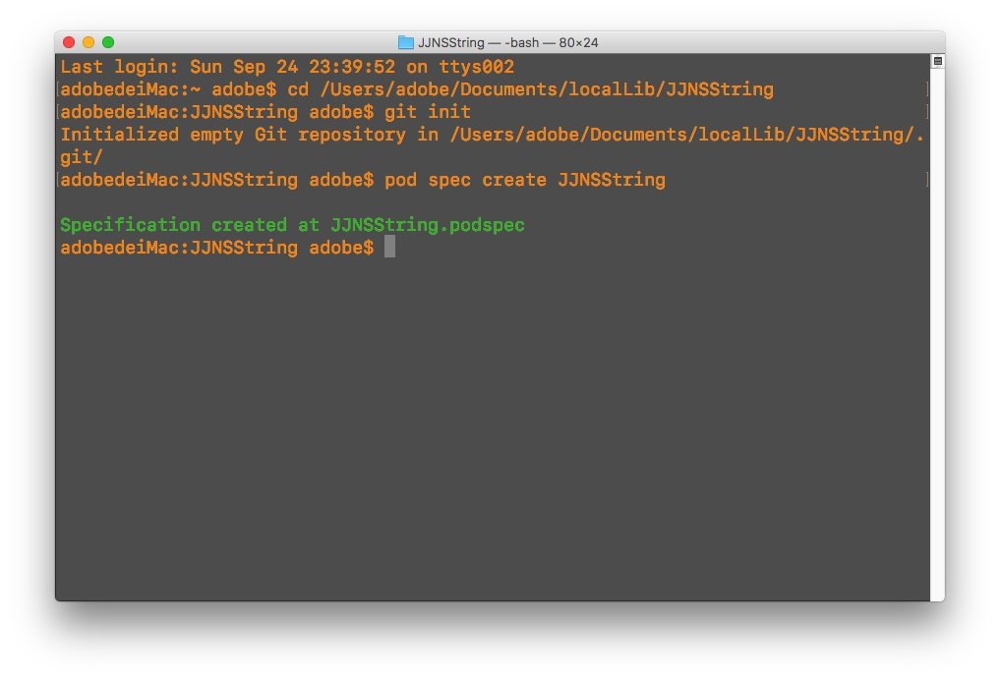
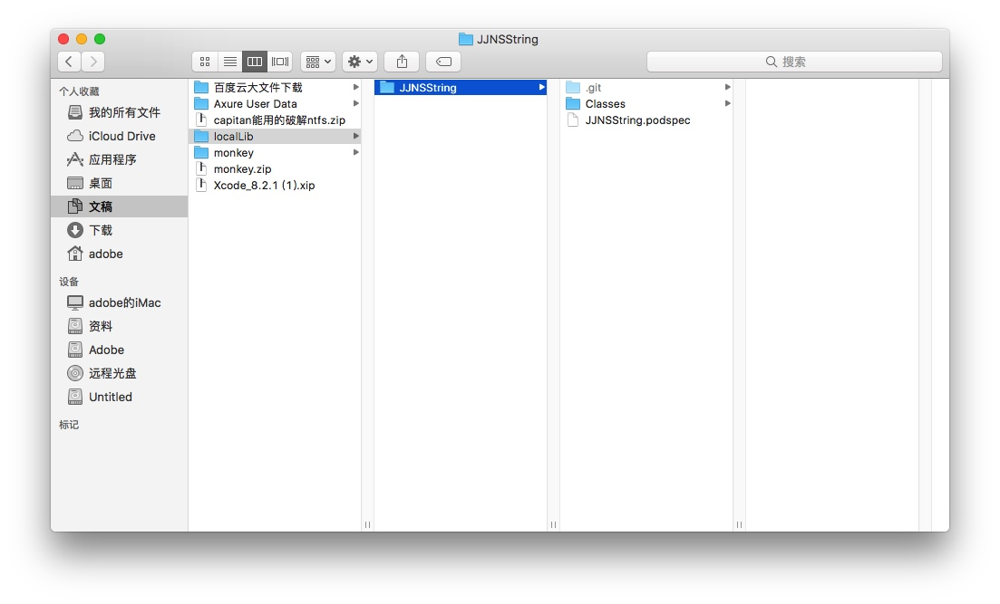
- 使用xcode打开podspec文件,并个性podspec文件参考下面格式

```
Pod::Spec.new do |s|

s.name         = "JJNSString" # 项目名称
s.version      = "0.0.1" # 版本号 与 你仓库的 标签号 对应
s.summary      = "JJNSString."  # 项目简介


s.description  = "JJNSString分类, 后期添加工具类"
s.homepage     = "http://EXAMPLE/XMGFMBase"


s.license      = "MIT" # 开源证书

s.author             = { "JJAdobe" => "271584255@qq.com" } # 作者信息

# s.platform     = :ios
# s.platform     = :ios, "5.0"

s.source       = { :git => "", :tag => "#{s.version}" } #你的仓库地址 本地这里为空

s.source_files  = "Classes", "Classes/**/*.{h,m}" # 你代码的位置
#s.exclude_files = "Classes/Exclude"

# s.public_header_files = "Classes/**/*.h"

end
```
### 本地私有库使用
- 新建CocoaPods测试项目
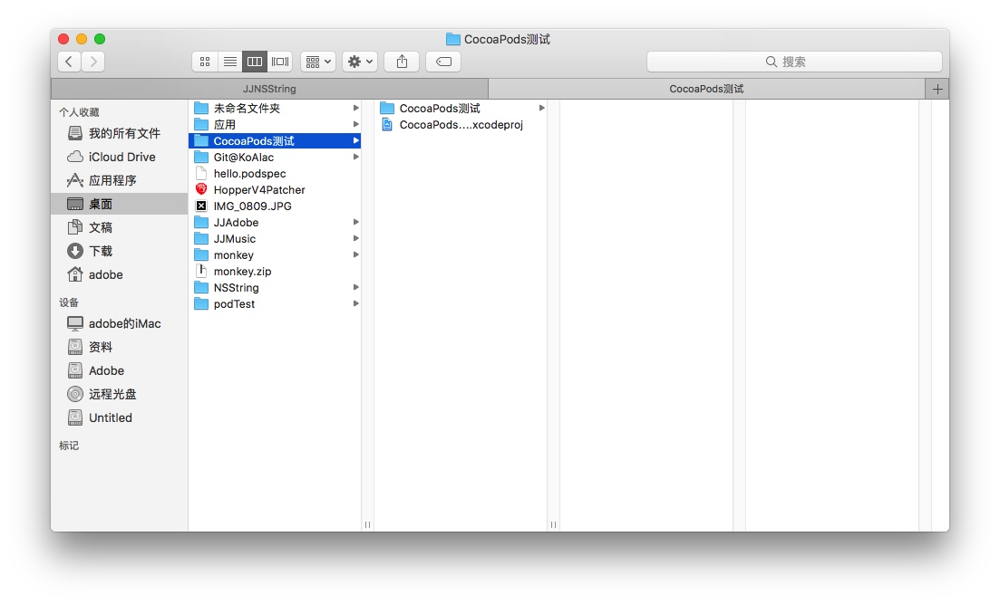

- 创建Podfile文件
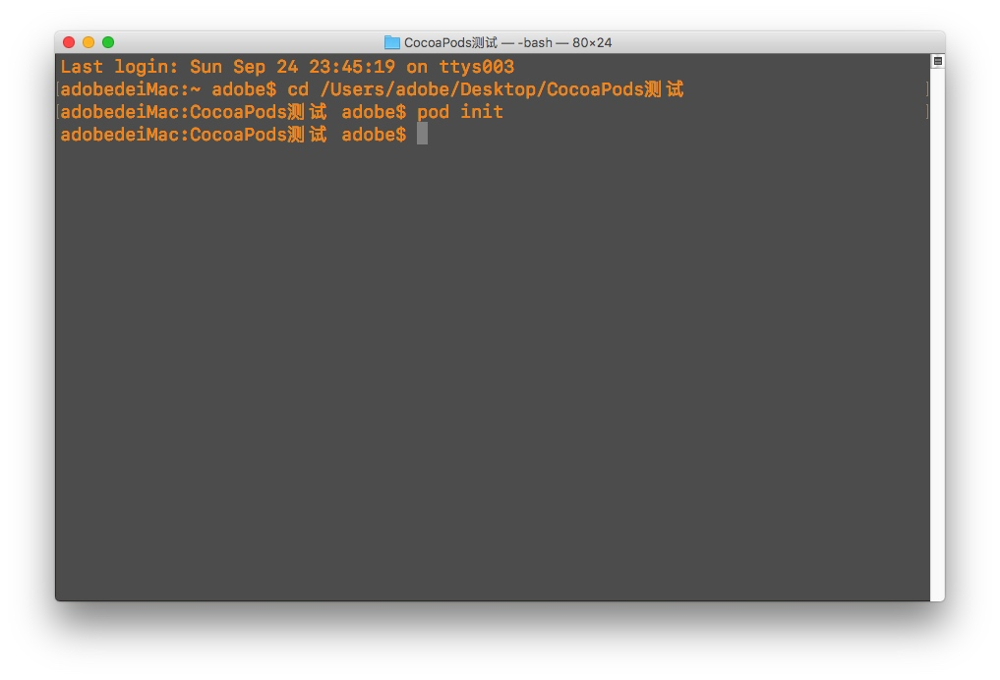
- 使用Xcode打开Podfile文件

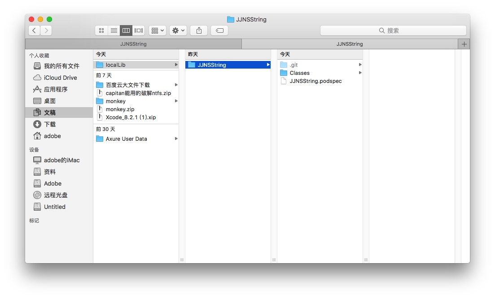

- 修改Podfile文件
    - 找到刚才的本地库路径(可以直接拖入到Xcode中,得到路径),可以参考下面格式
    
```
platform :ios, '9.0'
use_frameworks!
target 'CocoaPods测试' do
    pod 'JJNSString', :path => '/Users/adobe/Documents/localLib/JJNSString'
end
```

- 在刚才的CocoaPods测试项目中 pod install 本地私有库
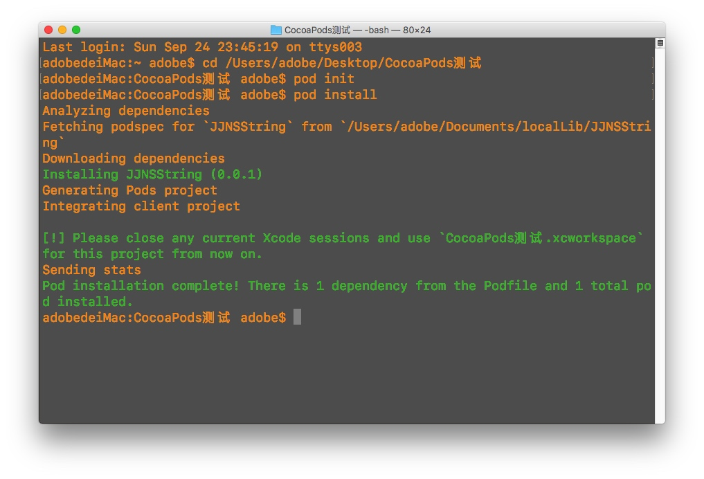
- 打开`CocoaPods测试.xcworkspace`
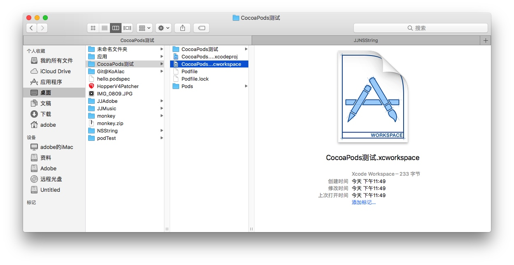
- 查看是否安装成功
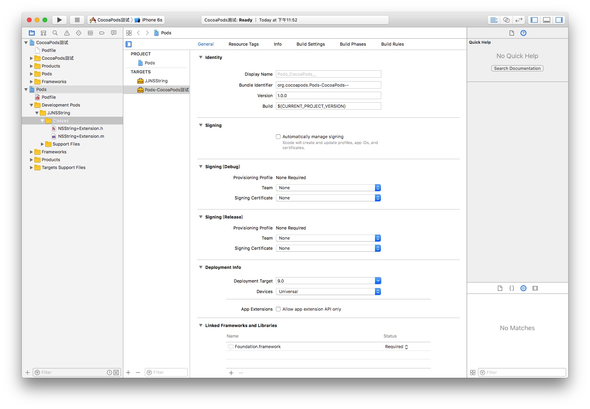


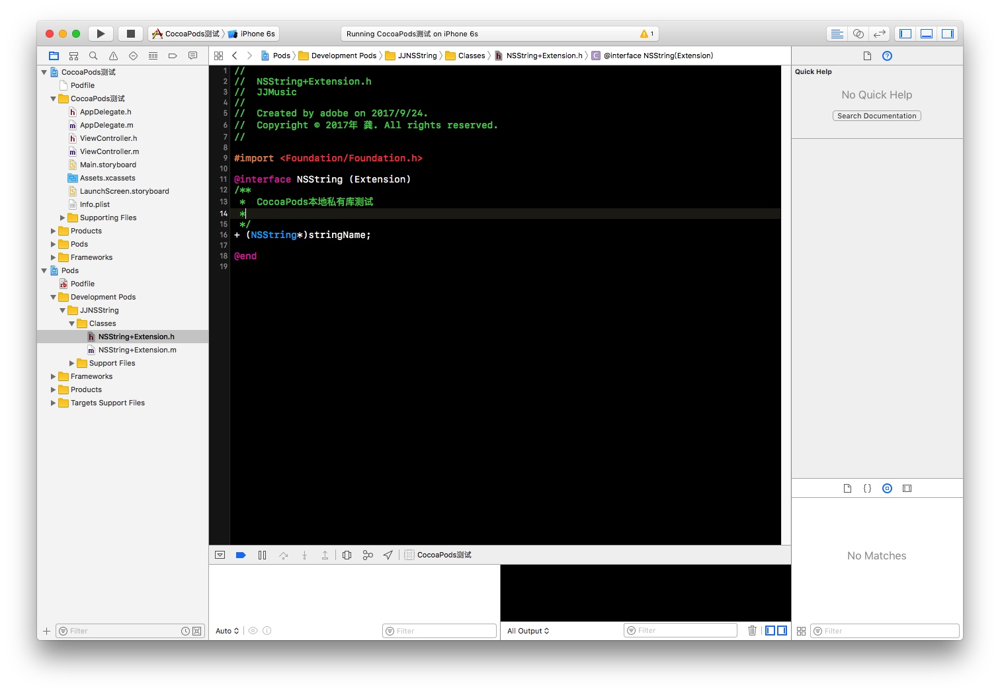

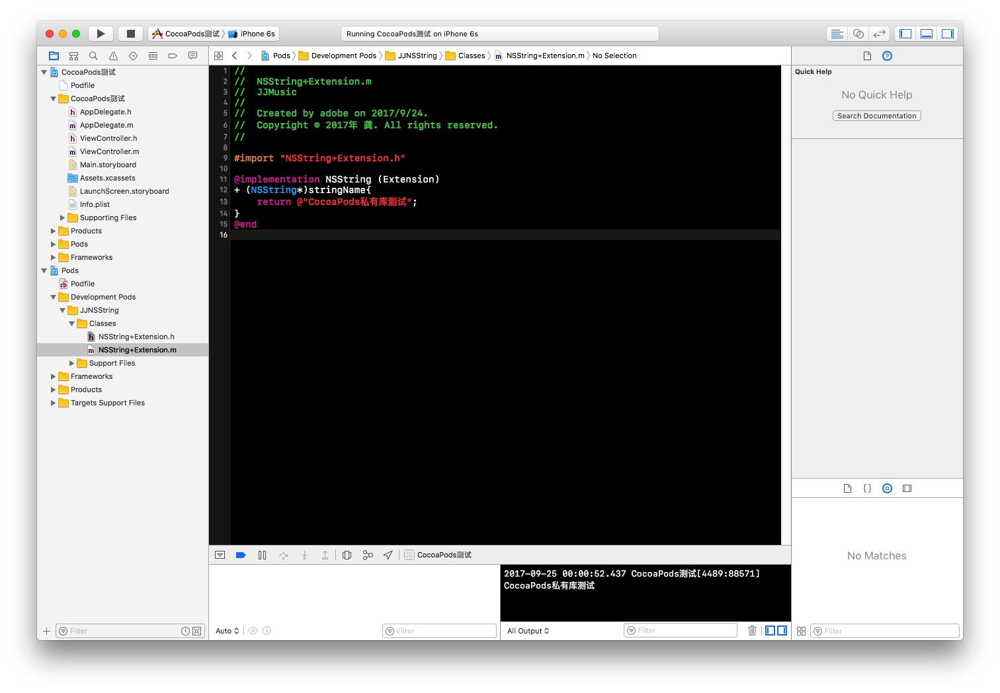
- 导入头文件,并使用,这里注意,这种本地私有采用的是`#impost ""`的方式,运行,查看相关打印信
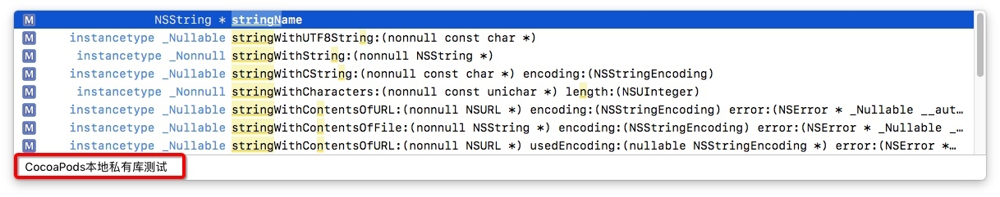

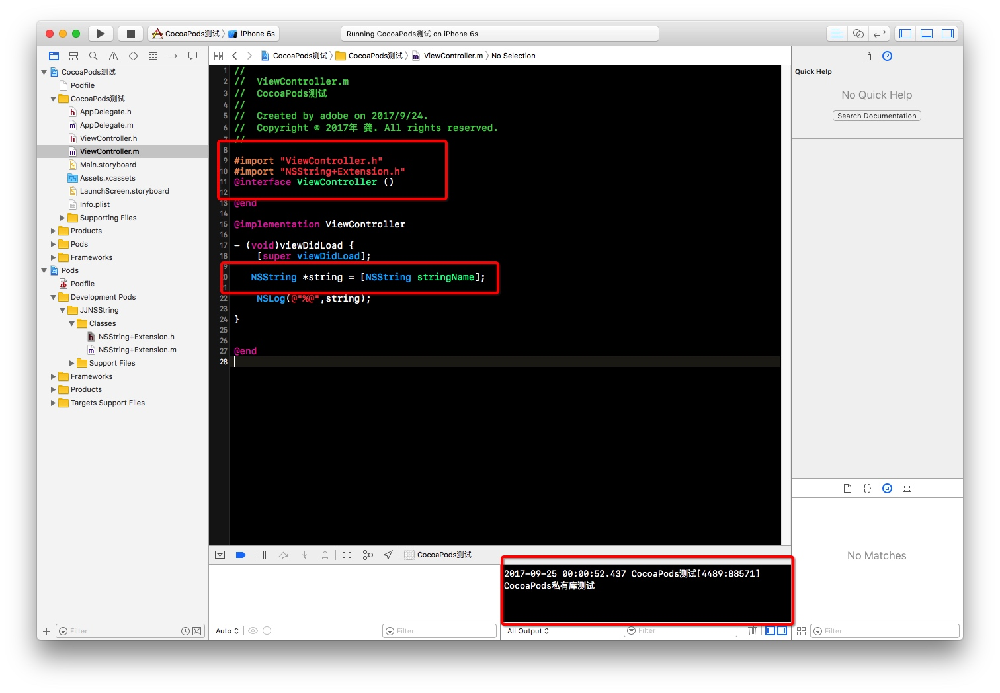

 到此CocoaPods本地私有库就做好了
 


