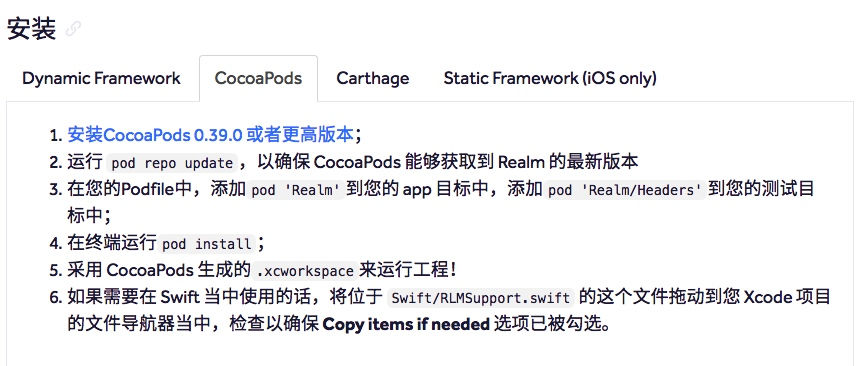

# Realm 使用前的准备


> 在上篇[Realm简单介绍]()中给大家简单的介绍了在iOS开发中`Realm`,今天给大家来简单介绍一下使用`Realm`前的一些准备.

### 准备工作
> 使用Realm构建应用的基本要求,iOS7及其以上版本,macOS 10.9及其以上版本,Xcode8.0或者以后的版本

#### 安装
- 在Realm文档里有介绍几种Realm的安装方式如下图所示


#### 导入Realm 框架
- 在Objective-C中使用`#import <Realm/Realm.h>`
- 在Swift中使用`import Realm`

#### 使用注意
- 在Objective‑C中使用Objective‑C版本的`Realm`
- 在Swift中使用Swift版本的`Realm`,也可以使用Objective‑C版本的`Realm`

> 如果您的项目上完全基于 Swift 构建的话，那么您应当考虑使用 Swift 版本的`Realm`。
> 注意：不能同时使用 Objective‑C 版本和 Swift 版本的`Realm`，两者是不可互操作的。

##### 在Swift当中使用Objective‑C版本的Realm
- Objective‑C 版本的 Realm 的设计目标包含了能够在 Objective‑C 和 Swift 混编的项目中使用。
- 在 Swift 中使用此 API 的话，您可以实现所有与在 Objective‑C 中使用 Realm 所能够完成的功能，例如定义模型以及使用 Realm 的 Objective‑C API。 然而，与纯 Objective‑C 项目相比，您仍然需要对某些部分进行一些小小的改变：
	 - RLMSupport.swift

		- 我们建议您将 Swift/RLMSupport.swift 文件一同编译进去（这个文件您同样能够在我们的发行版本压缩包中找到）。

		- 这个文件为 Objective-C 版本的 Realm 集合类型中引入了 Sequence 一致性，并且重新暴露了一些不能够从 Swift 中进行原生访问的 Objective-C 方法，例如可变参数 (variadic arguments)。

		- Objective‑C 版本的 Realm 默认情况下不包含这个文件，因为这会强制让所有使用 Objective‑C 版本 Realm 的用户去包含额外的 Swift 动态库，不管他们有没有在项目中使用 Swift！

	- RLMArray 属性

		- 在 Objective‑C 中，我们依赖协议一致性，从而让 Realm 能够明白 RLMArray 对多关系 中包含的对象类型。在 Swift 中，这种类型的语法是不可能实现的。因此，您应当用下列语法形式来声明您的 RLMArray 属性：

		```
		Copy to clipboardclass Person: RLMObject {
		  dynamic var dogs = RLMArray(objectClassName: Dog.className())
		}
		
		```

		- 这等同于 Objective‑C 中的声明：

		```
		Copy to clipboard@interface Person : RLMObject
		@property RLMArray<Dog *><Dog> *dogs;
		@end
		
		```


### 数据模型(Model)
- Realm数据模型是基于标准 Objective‑C 类来进行定义的，使用属性来完成模型的具体定义
- 通过简单的简单继承`RLMObject`或者已经存在的模型,你就可以创建一个新的`RLMObject`模型对象
- Realm模型对象在形式上基本上与其他 Objective‑C 对象相同 - 您可以给它们添加您自己的方法(method)和协议(protocol)，和在其他对象中使用类似。
- 主要的限制是某个对象只能在其被创建的那个线程中使用, 并且您无法访问任何存储属性的实例变量(ivar)。
- 如果您安装了我们的Xcode插件 ，那么可在”New File…“对话框中会有一个很漂亮的模板，可用来创建接口(interface)和执行(implementation)文件。
- 您只需要为对象的类型列表添加目标类型的属性，或者RLMArray，就可以创建数据关系(relationship)和嵌套数据结构(nested data structure)。
- example

```
#import <Realm/Realm.h>

@class Person;

// 狗狗的数据模型
@interface Dog : RLMObject
@property NSString *name;
@property Person   *owner;
@end
RLM_ARRAY_TYPE(Dog) // 定义RLMArray<Dog>

// 狗狗主人的数据模型
@interface Person : RLMObject
@property NSString      *name;
@property NSDate        *birthdate;
@property RLMArray<Dog> *dogs;
@end
RLM_ARRAY_TYPE(Person) // 定义RLMArray<Person>

// 实现文件
@implementation Dog
@end // 暂时没用

@implementation Person
@end // 暂时没用
```
- 由于 Realm 中定义的所有模型在程序启动时就会被解析，所以即使代码中没有调用，它们都需要被初始化。

- 在 Swift 中使用 Realm 的时候，Swift.reflect(_:) 函数可用于确定您模型中的信息，这需要确保 init() 已被成功调用。这意味着所有非可选的属性必须添加一个默认值。

### 支持的数据类型
- BOOL, bool, int, NSInteger, long, long long, float, double, NSString, NSDate, NSData, and NSNumber

> 注意:不支持集合类型

-  解决方案:
	-  序列化成NSData进行存储
	-  转换成RLMArray<RLMObject>进行存储
	
### 可空属性&&默认值&&忽略属性
- 默认情况下,属性值可空,如果强制要求某个属性非空,可以重写您的 RLMObject 子类的 +requiredProperties 方法。

```
@interface Person : RLMObject
@property NSString *name;
@property NSDate *birthday;
@end

@implementation Person
+ (NSArray *)requiredProperties {
    return @[@"name"];
}
@end
```
- RLMProperty 的子类属性始终都可以为 nil，因此这些类型不能够放在 requiredProperties中，并且 RLMArray 不支持存储 nil 值。

> 如果再次赋值为nil, 则会抛出异常错误

- 也可以设置为默认值,重写`+defaultPropertyValues` 可以每次在对象创建之后为其提供默认值。

```
@interface Book : RLMObject
@property float price;
@property NSString *title;
@end

@implementation Book
+ (NSDictionary *)defaultPropertyValues {
    return @{@"price" : @0, @"title": @""};
}
@end

```


- 忽略属性
	- 不想存储的某些属性,重写`+ignoredProperties`可以防止 Realm 存储数据模型的某个属性,Realm 将不会干涉这些属性的常规操作，它们将由成员变量(ivar)提供支持，并且您能够轻易重写它们的 setter 和 getter。
	- 忽略属性的行为与 Objective-C 或者 Swift 类当中的普通对象_相似_。它们并不支持任何一种 Realm 特定的功能。例如，无法通过查询来检索忽略属性，也无法实现自动更新，即便另一个相同对象的实例的忽略属性值发生了变更。此外忽略属性发生更改的时候也不会触发通知，尽管仍然可以使用 KVO 来实现简直观察。
	
```
@interface Person : RLMObject
@property NSInteger tmpID;
@property (readonly) NSString *name; // 只读属性将被自动忽略
@property NSString *firstName;
@property NSString *lastName;
@end

@implementation Person
+ (NSArray *)ignoredProperties {
    return @[@"tmpID"];
}
- (NSString *)name {
    return [NSString stringWithFormat:@"%@ %@", self.firstName, self.lastName];
}
@end


```

- 开发经验
	- 可以借助忽略属性&只读属性 打造计算属性, 完成集合以及UIImage对象的存储与获取
	


### 关系(Relationships)
- RLMObject 能够借助 RLMObject 以及 RLMArray属性来和另一个 RLMObject 建立联系。 RLMArray 的接口和 NSArray 非常类似，在 RLMArray 中的对象能够通过索引下标(indexed subscripting)进行访问。 与 NSArray 所不同的是，RLMArray 的类型是固定的，其中只能存放简单的 RLMObject 子类类型
- 对一(一对一,多对一)
- 对多
- 反向关系

- [参考链接](https://realm.io/cn/docs/objc/latest/)

