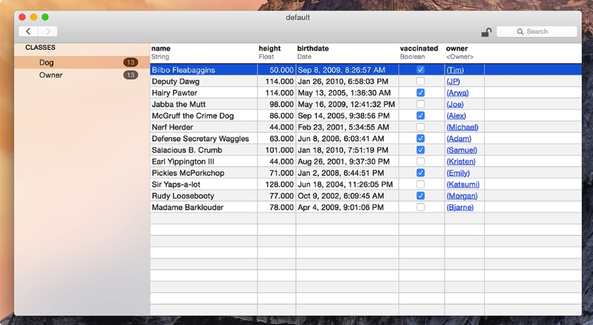
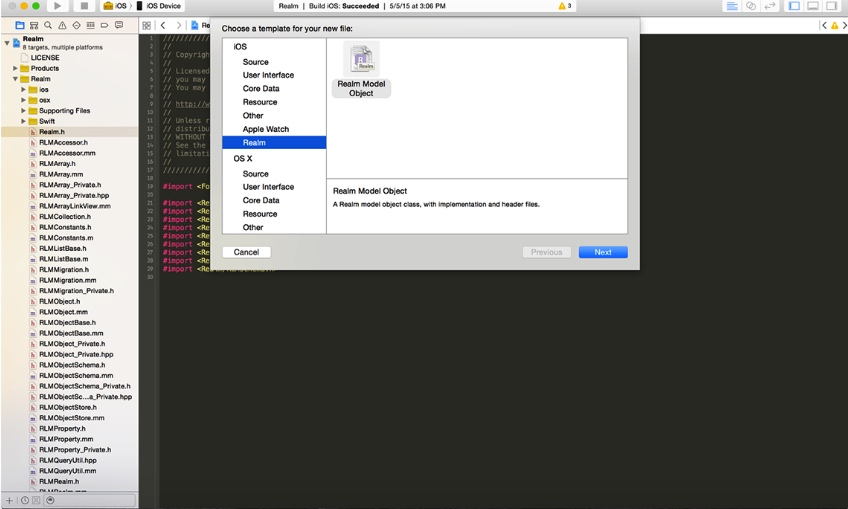

# Realm 简单介绍
### 简介

> 核心数据引擎C++打造，并不是建立在SQLite之上的ORM, 是拥有独立的数据库存储引擎

- Realm是一个跨平台移动数据库引擎,支持iOS,OS X(Objective-C和Swift)以及Android,Javascript
- 性能优于SQLite,CoreData
- 使用起来,比SQLite,CoreData更简单,方便.

> 如果您的应用中只打算使用纯 Swift 进行开发，那么您应当考虑使用 Realm 的 Swfit 版本。 注意：不能同时使用 Objective‑C 版本和 Swift 版本的 Realm，两者是不可互操作的。

### 使用教程

- 使用教程:[https://realm.io/cn/docs/objc/latest/](https://realm.io/cn/docs/objc/latest/)

### 辅助工具
- Realm Browser 
	- Realm浏览器/数据库管理器
	- 可以直接在MAC上App Store下载
	- 可以对.realm数据库进行读取和编辑。
	

- Xcode 插件
	- Realm Model
	- 打开release zip 中的plugin/RealmPlugin.xcodeproj
	- 下载链接:[https://static.realm.io/downloads/objc/realm-objc-2.10.1.zip?_ga=2.164169661.342328786.1506391915-793406061.1505270900](https://static.realm.io/downloads/objc/realm-objc-2.10.1.zip?_ga=2.164169661.342328786.1506391915-793406061.1505270900)

- [参考链接](https://realm.io/cn/docs/objc/latest/)

