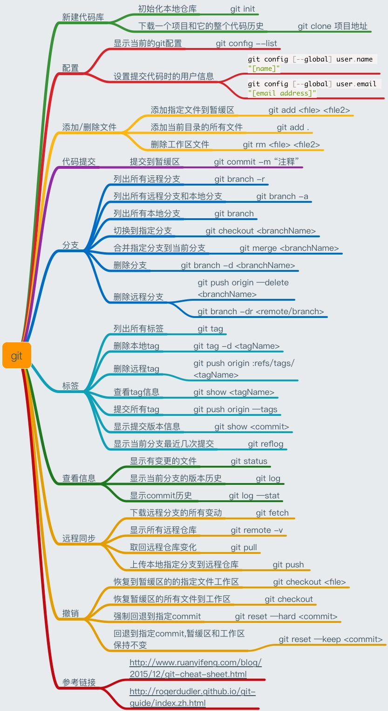
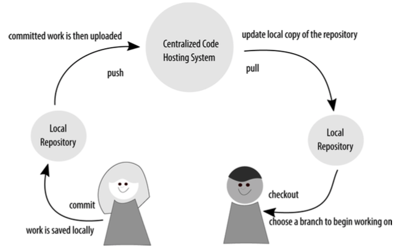
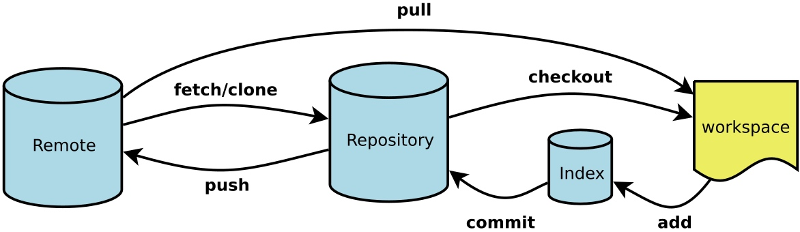

# git常用命令

> 在日常开发中,为了管理代码,经常会用到版本控制管理,常见的有svn,git,现在大多数是都是git,git的分布式很好用.

### git 简介
> 分布式版本控制系统

#### 常用名词

- 工作区 
    -  与.git文件夹同级的其他文件夹或者子文件夹
- 暂缓区
- 分支
    - git不像svn那样有主干和分支的概念,仅仅存在分支,其中master分支为默认被创建的分支,相当于svn中的主干
- 标签
- 本地仓库
- 远程仓库

> 操作原则 : 所有添加/删除/修改的文件,必须添加到暂缓区,然后才能提交到HEAD指向的当前分支中
> 切换分支 : 通过控制HEAD指针指向不同的分支

- [参考链接](https://www.liaoxuefeng.com/wiki/0013739516305929606dd18361248578c67b8067c8c017b000/001373962845513aefd77a99f4145f0a2c7a7ca057e7570000)

