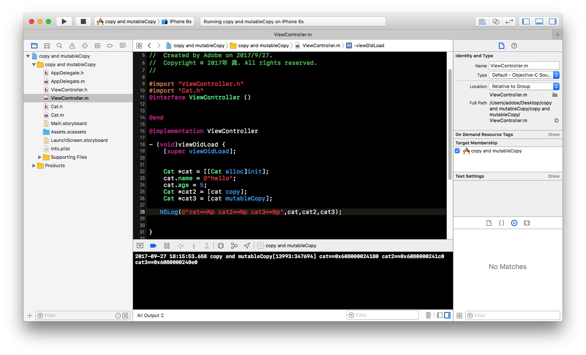
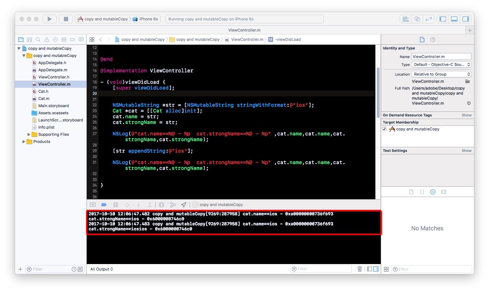

# iOS 之 copy && mutableCopy 和 深拷贝 && 浅拷贝


> 在iOS日常开发中, 有深拷贝, 浅拷贝的概念. 也有copy语法跟mutableCopy语法, 今天就给大家介绍下`深拷贝`跟`浅拷贝`和`copy`跟`mutableCopy`

 在日常生活中, 电脑桌面上有一个`a.text`, 我们把它拷贝一份`a副本.text`, 这个过程就叫做拷贝. 那么属于深拷贝和浅拷贝中的那种呢? 其实这里使用的是深拷贝. 这个过程中使用的是什么语法呢? `copy` 还是`mutableCopy`呢? 在这里我们使用的是mutableCopy方法, 伪代码大概是这个样子`[a mutableCopy]`, 这里a代表`a.text`这个对象, 下面会为大家解惑.

### 深拷贝 && 浅拷贝
> 在iOS开发中, 拷贝有两种方式：深拷贝和浅拷贝。 顾名思义，浅拷贝，并不拷贝对象本身，仅仅是拷贝对象所指向的指针地址；深拷贝是直接拷贝整个对象内存到另一块内存中。

- 简单来说如果你拷贝了一个对象a, 拷贝后的对象, 这里我们称它为b, 你修改b对象的时候不会影响到对象a, 修改a对象也不会影响到对象b, 那么这种其实就是深拷贝, 因为产生了新的对象, 对象a跟对象b互不影响. 同理, 如果你修改对象a, 对象b的值也发生了改变了, 这就说明我们拷贝的仅仅是对象a指向的内存地址. 这种就是浅拷贝.

- 这就解释了上面说的例子属于深拷贝, 因为`a.text`跟`a副本.text`, 他们两个相不相关, 修改`a.text`的内容, 并不会影响到`a副本.text`中的内容. 所在内存中的地址也不一样.

### copy && mutableCopy
上面跟大家说到了深拷贝跟浅拷贝,那么在我们开发中,是使用`copy`还是`mutableCopy`呢,使用什么语法,其实还是要看我们项目中,是否需要产生新的对象,简单来说就是是深拷贝还是浅拷贝.那么使用`copy`语法,会产生新对象吗?什么情况下产生新对象?使用`copy`语法,会产生新对象吗?什么情况下产生新对象?下面我们举例说明.

#### example


> 如上所示:可以得到以下结论
- NSString
	- copy
		- 副本对象类型 : NSString
		- 是否产生新对象 : 否
		- 拷贝类型 : 浅拷贝(指针拷贝)
	- mutableCopy
		- 副本对象类型 : NSMutableString
		- 是否产生新对象 : 是
		- 拷贝类型 : 深拷贝(内容拷贝)
		
- NSMutableString
	- copy
		- 副本对象类型 : NSMutableString
		- 是否产生新对象 : 是
		- 拷贝类型 : 深拷贝(内容拷贝)
	- mutableCopy
		- 副本对象类型 : NSMutableString
		- 是否产生新对象 : 是
		- 拷贝类型 : 深拷贝(内容拷贝)


- 点到头文件中我们可以看出之所以我们可以使用`copy`和`mutableCopy`是因为我们遵守了`<NSCopying,NSMutableCopying>`协议

- 一些常用的数据类型,NSString,NSMutableString,NSArray,NSMutableArray.....等都可以使用`copy`跟`mutableCopy`,如果是我们自己对象,要使用`copy`和`mutableCopy`就需要遵守`<NSCopying,NSMutableCopying>`协议

- 我们新建模型Cat,实现`copyWithZone:`和`mutableCopyWithZone`方法

```
#import <Foundation/Foundation.h>

@interface Cat : NSObject<NSCopying,NSMutableCopying>

@property (copy,nonatomic)NSString *name;
@property (assign,nonatomic)NSInteger age;

@end
```


```
#import "Cat.h"

@implementation Cat

- (id)copyWithZone:(NSZone *)zone{
    
    Cat *cat = [[[self class] allocWithZone:zone]init];
    cat.name = self.name;
    cat.age = self.age;
    return cat;
}


- (id)mutableCopyWithZone:(NSZone *)zone{
    Cat *cat = [[[self class] allocWithZone:zone]init];
    cat.name = self.name;
    cat.age = self.age;
    return cat;
}

@end
```

- 通过下面的打印我们可以看到




### @property 中的copy && strong
> 在类的属性中,会用到`@property`关键字,那么如果是一个`NSString`类型的字符串,使用`strong`跟`copy`有什么区别呢?

- 增加copy,strong

```
#import <Foundation/Foundation.h>

@interface Cat : NSObject<NSCopying,NSMutableCopying>

@property (copy,nonatomic)NSString *name;
@property (assign,nonatomic)NSInteger age;
@property (strong,nonatomic)NSString *strongName;

@end
```


- example

```
- (void)viewDidLoad {
    [super viewDidLoad];
    

    NSMutableString *str = [NSMutableString stringWithFormat:@"ios"];
    Cat *cat = [[Cat alloc]init];
    cat.name = str;
    cat.strongName = str;
    
    NSLog(@"cat.name==%@ - %p  cat.strongName==%@ - %p" ,cat.name,cat.name,cat.strongName,cat.strongName);
    
    [str appendString:@"ios"];
    
    NSLog(@"cat.name==%@ - %p  cat.strongName==%@ - %p" ,cat.name,cat.name,cat.strongName,cat.strongName);

    
}

```



- 综上所述,我们可以得出结论
	- 在`@property`中,如果使用`strong`关键字,如果赋值给属性的值变了,属性的值也会跟着改变,使用`copy`刚不会因为属性的值的改变而改变


